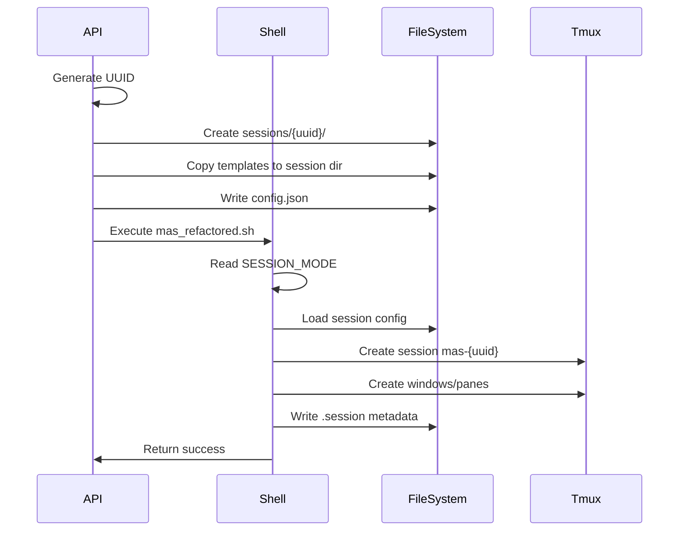
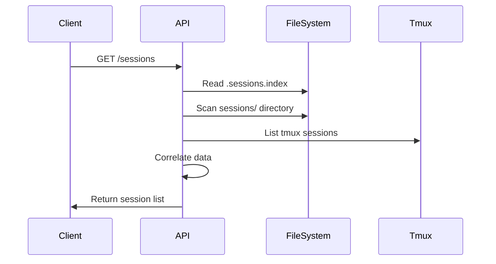

# Design Document: Isolate Session Workspaces

## Architecture Overview

### Current State
```
mas/
├── unit/                  # Shared by all sessions
├── workflows/             # Shared by all sessions
├── mas_refactored.sh      # Main script
└── api/                   # API server
```

### Target State
```
mas/
├── sessions/              # New: Session isolation root
│   ├── {uuid}/           # Per-session workspace
│   └── .sessions.index   # Session registry
├── unit/                  # Templates only
├── workflows/             # Templates only
├── mas_refactored.sh      # Updated for multi-session
└── api/                   # Updated for session isolation
```

## Key Design Decisions

### 1. Directory-Based Isolation
**Decision**: Use filesystem directories for session isolation instead of virtualization or containers.

**Rationale**:
- Simple implementation with standard Unix tools
- No additional dependencies
- Easy to debug and inspect
- Compatible with existing tmux-based architecture

**Trade-offs**:
- (+) Simple, transparent, portable
- (+) Easy backup and restore
- (-) No process-level isolation
- (-) Potential for disk space consumption

### 2. UUID-Based Naming
**Decision**: Use full UUID v4 for session directories, shortened form for tmux sessions.

**Rationale**:
- UUIDs guarantee uniqueness without coordination
- Full UUID in filesystem prevents collisions
- Short form (first 8 chars) for tmux readability

**Example**:
- Session ID: `550e8400-e29b-41d4-a716-446655440000`
- Directory: `sessions/550e8400-e29b-41d4-a716-446655440000/`
- Tmux name: `mas-550e8400`

### 3. Template-Based Initialization
**Decision**: Copy unit/workflow templates at session creation time.

**Rationale**:
- Complete isolation between sessions
- Sessions can modify their units without affecting others
- Templates remain pristine for future sessions

**Alternative Considered**: Symbolic links
- Rejected because changes would affect all sessions

### 4. Session Metadata Format
**Decision**: Use shell-compatible key-value format for `.session` file.

**Format**:
```bash
SESSION_ID=550e8400-e29b-41d4-a716-446655440000
TMUX_SESSION=mas-550e8400
STATUS=active
CREATED_AT=2025-12-18T08:00:00Z
```

**Rationale**:
- Direct sourcing in shell scripts
- Human-readable
- No JSON parsing required in shell

### 5. Dual-Mode Operation
**Decision**: Support both legacy (single-session) and isolated (multi-session) modes.

**Mode Selection**:
```bash
MAS_SESSION_MODE=legacy    # Default, current behavior
MAS_SESSION_MODE=isolated   # New multi-session mode
```

**Rationale**:
- Backward compatibility for existing users
- Gradual migration path
- Testing and validation before full transition

## Component Interactions

### Session Creation Flow


### Session Discovery Flow


## File Structure Details

### Session Directory Layout
```
sessions/{uuid}/
├── .session                 # Metadata (shell format)
├── .session.lock           # Concurrent access lock (optional)
├── config.json             # Original API configuration
├── unit/                   # Copied from templates
│   ├── 00/                 # Meta Manager
│   ├── 10-13/              # Design Unit
│   ├── 20-23/              # Development Unit
│   └── 30-33/              # Business Unit
├── workflows/              # Copied from templates
│   ├── 00_meta_manager.md
│   └── ...
└── logs/                   # Session-specific logs
    ├── api.log
    ├── session.log
    └── agent-{id}.log
```

### Session Index Format
```json
{
  "version": "1.0",
  "sessions": [
    {
      "sessionId": "550e8400-e29b-41d4-a716-446655440000",
      "tmuxSession": "mas-550e8400",
      "status": "active",
      "createdAt": "2025-12-18T08:00:00Z",
      "lastActivity": "2025-12-18T08:05:00Z"
    }
  ],
  "lastUpdated": "2025-12-18T08:05:00Z"
}
```

## API Changes

### Updated Endpoints

#### POST /runs
```typescript
interface RunRequest {
  agents: AgentConfig;
  // New optional field
  sessionMode?: 'legacy' | 'isolated';
}

interface RunResponse {
  sessionId: string;        // Full UUID
  tmuxSession: string;       // Tmux session name
  workingDir: string;        // Session directory path
  sessionMode: string;       // Mode used
  // ...existing fields
}
```

#### GET /sessions
```typescript
interface SessionListResponse {
  sessions: SessionInfo[];
  total: number;
}

interface SessionInfo {
  sessionId: string;
  tmuxSession: string;
  status: 'active' | 'stopped' | 'error';
  createdAt: string;
  workingDir: string;
  mode: 'legacy' | 'isolated';
}
```

## Shell Script Changes

### Environment Variables
```bash
# New variables
MAS_SESSION_MODE    # 'legacy' or 'isolated'
MAS_SESSION_ID      # Full UUID for isolated mode
MAS_SESSION_DIR     # Path to session directory

# Modified behavior
SESSION_NAME        # Now includes UUID prefix in isolated mode
UNIT_DIR           # Points to session-specific directory
WORKFLOWS_DIR      # Points to session-specific directory
```

### New Functions in lib/session.sh
```bash
# Create isolated session workspace
create_session_workspace() {
    local session_id="$1"
    local config_file="$2"
    # Implementation...
}

# Initialize session from templates
initialize_session_units() {
    local session_dir="$1"
    # Copy templates...
}

# Load session by ID
load_session() {
    local session_id="$1"
    # Set environment from .session file...
}
```

## Error Handling

### Session Creation Failures
1. Directory already exists → Return error, don't overwrite
2. Template copy fails → Rollback, remove partial directory
3. Tmux creation fails → Clean up directory, return error

### Session Access Errors
1. Session not found → Return 404
2. Session directory corrupted → Mark as error state
3. Tmux session missing → Attempt recovery or mark stopped

## Performance Considerations

### Disk Usage
- Estimated: 70-200MB per session
- Unit templates: ~65MB (13 units × 5MB)
- Workflows: ~50KB
- Logs: Variable (1-100MB typical)

### Optimization Strategies
1. **Copy-on-Write**: Use filesystem CoW if available (btrfs, zfs)
2. **Hard Links**: For read-only files within units
3. **Lazy Loading**: Initialize units on-demand
4. **Compression**: For archived sessions (future)

### Monitoring
```bash
# Session count
find sessions/ -maxdepth 1 -type d | wc -l

# Total disk usage
du -sh sessions/

# Active sessions
tmux ls | grep "^mas-" | wc -l
```

## Security Considerations

### File Permissions
```bash
sessions/              # 755 - User readable
├── {uuid}/           # 700 - User only
│   ├── .session      # 600 - User only
│   ├── config.json   # 600 - User only
│   └── unit/         # 755 - Normal permissions
```

### Session Isolation
- No cross-session file access
- Each session has independent workspace
- No shared state except templates

### Input Validation
- UUID format validation
- Path traversal prevention
- Tmux command injection prevention

## Migration Strategy

### Phase 1: Add Infrastructure
1. Create `sessions/` directory structure
2. Add session management functions
3. Update API with mode parameter
4. Default to legacy mode

### Phase 2: Enable Isolated Mode
1. Test isolated mode with new sessions
2. Document mode selection
3. Update client applications
4. Monitor for issues

### Phase 3: Migration Tools (Future)
1. Tool to convert legacy to isolated
2. Bulk session management
3. Cleanup utilities

## Testing Strategy

### Unit Tests
- UUID generation and validation
- Directory creation and cleanup
- Metadata file parsing
- Template copying

### Integration Tests
- Full session lifecycle
- Multiple concurrent sessions
- Mode switching
- API endpoint validation

### Performance Tests
- Session creation time
- Disk usage patterns
- Concurrent session limits
- Cleanup efficiency

## Rollback Plan

If issues arise with isolated mode:
1. Set `MAS_SESSION_MODE=legacy` globally
2. Existing isolated sessions continue to work
3. New sessions use legacy mode
4. Fix issues in isolated mode
5. Re-enable when ready

## Future Enhancements

### Potential Extensions (Not in Current Scope)
1. **Auto-cleanup**: Configurable retention policies
2. **Session Templates**: Custom unit configurations
3. **Session Sharing**: Multi-user access control
4. **Resource Limits**: Per-session quotas
5. **Session Migration**: Move between hosts
6. **Distributed Sessions**: Cross-machine coordination