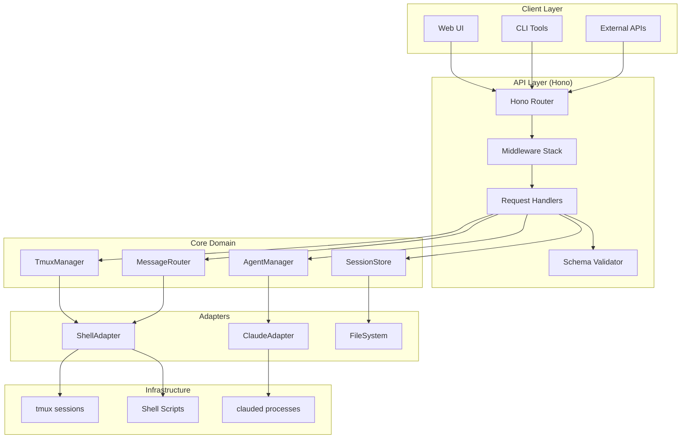

# Design: MASバックエンドのHono移行アーキテクチャ

## Architecture Overview



## Key Design Decisions

### 1. Layered Architecture

**Decision**: 明確なレイヤー分離を採用

```typescript
// API Layer - プレゼンテーション層
app.post('/api/runs', validateRequest, async (c) => {
  const body = await c.req.json<RunRequest>();
  const session = await runService.create(body);
  return c.json(session);
});

// Service Layer - ビジネスロジック
class RunService {
  async create(request: RunRequest): Promise<Session> {
    const session = await this.sessionStore.create();
    await this.tmuxManager.createSession(session.id);
    await this.agentManager.deployAgents(session, request.agents);
    return session;
  }
}

// Domain Layer - コアエンティティ
class Agent {
  constructor(
    readonly id: string,
    readonly role: AgentRole,
    readonly model: ModelType,
    readonly prompt: string
  ) {}
}

// Infrastructure Layer - 外部システム連携
class TmuxAdapter implements ITmuxManager {
  async createSession(name: string): Promise<void> {
    await this.shell.execute(`tmux new-session -d -s ${name}`);
  }
}
```

**Rationale**:
- 関心事の明確な分離
- テスタビリティの向上
- 依存性の逆転による柔軟性

### 2. Adapter Pattern for Legacy Integration

**Decision**: 既存シェルスクリプトをアダプター経由で呼び出し

```typescript
interface IShellAdapter {
  execute(command: string, options?: ExecOptions): Promise<ShellResult>;
  stream(command: string): AsyncIterable<string>;
}

class ShellAdapter implements IShellAdapter {
  async execute(command: string, options?: ExecOptions): Promise<ShellResult> {
    // 初期実装: child_processでシェルスクリプト実行
    const { stdout, stderr, exitCode } = await exec(command, options);

    // 将来: ネイティブTypeScript実装に段階的に置き換え
    // if (command.startsWith('mas send')) {
    //   return this.nativeSend(parseArgs(command));
    // }

    return { stdout, stderr, exitCode };
  }
}

// 使用例
class MessageRouter {
  constructor(private shell: IShellAdapter) {}

  async send(target: string, message: string): Promise<void> {
    // Phase 1: 既存のsend_message.sh利用
    await this.shell.execute(`./send_message.sh -t ${target} -m "${message}"`);

    // Phase 2: ネイティブ実装
    // const targets = this.expandTarget(target);
    // await Promise.all(targets.map(t => this.sendToAgent(t, message)));
  }
}
```

**Rationale**:
- 既存資産の活用
- リスクを最小化した段階的移行
- インターフェースによる実装の隠蔽

### 3. Event-Driven State Management

**Decision**: イベントソーシングによる状態管理

```typescript
// イベント定義
type SystemEvent =
  | { type: 'SESSION_CREATED'; sessionId: string; timestamp: Date }
  | { type: 'AGENT_STARTED'; agentId: string; sessionId: string }
  | { type: 'MESSAGE_SENT'; from: string; to: string; content: string }
  | { type: 'AGENT_STOPPED'; agentId: string; reason: string };

// イベントストア
class EventStore {
  private events: SystemEvent[] = [];
  private subscribers: Set<(event: SystemEvent) => void> = new Set();

  append(event: SystemEvent): void {
    this.events.push(event);
    this.persist(event);
    this.notify(event);
  }

  replay(from?: Date): SystemEvent[] {
    return from
      ? this.events.filter(e => e.timestamp >= from)
      : this.events;
  }
}

// 状態の再構築
class SessionStore {
  constructor(private eventStore: EventStore) {}

  async rebuild(): Promise<Map<string, Session>> {
    const sessions = new Map<string, Session>();
    const events = this.eventStore.replay();

    for (const event of events) {
      switch (event.type) {
        case 'SESSION_CREATED':
          sessions.set(event.sessionId, new Session(event.sessionId));
          break;
        case 'AGENT_STARTED':
          sessions.get(event.sessionId)?.addAgent(event.agentId);
          break;
        // ...
      }
    }

    return sessions;
  }
}
```

**Rationale**:
- 完全な監査ログ
- 状態の再現性
- デバッグとトラブルシューティングの容易性

### 4. Dependency Injection Container

**Decision**: DIコンテナによる依存性管理

```typescript
// DIコンテナの設定
import { Container } from 'inversify';

const container = new Container();

// インターフェースとシンボル
const TYPES = {
  ITmuxManager: Symbol.for('ITmuxManager'),
  IAgentManager: Symbol.for('IAgentManager'),
  IMessageRouter: Symbol.for('IMessageRouter'),
  ISessionStore: Symbol.for('ISessionStore'),
  IShellAdapter: Symbol.for('IShellAdapter'),
};

// バインディング
container.bind(TYPES.ITmuxManager).to(TmuxManager).inSingletonScope();
container.bind(TYPES.IAgentManager).to(AgentManager).inSingletonScope();
container.bind(TYPES.IMessageRouter).to(MessageRouter).inSingletonScope();
container.bind(TYPES.ISessionStore).to(SessionStore).inSingletonScope();
container.bind(TYPES.IShellAdapter).to(ShellAdapter).inSingletonScope();

// 使用
class RunService {
  constructor(
    @inject(TYPES.ITmuxManager) private tmux: ITmuxManager,
    @inject(TYPES.IAgentManager) private agents: IAgentManager,
    @inject(TYPES.ISessionStore) private store: ISessionStore,
  ) {}
}
```

**Rationale**:
- 疎結合な設計
- テスト時のモック注入が容易
- 設定の一元管理

### 5. Streaming & WebSocket Support

**Decision**: リアルタイム通信のためのWebSocketサポート

```typescript
// WebSocketハンドラー
app.get('/ws/session/:id', upgradeWebSocket((c) => {
  const sessionId = c.req.param('id');

  return {
    onOpen(event, ws) {
      // セッション購読
      subscribeToSession(sessionId, (update) => {
        ws.send(JSON.stringify(update));
      });
    },

    onMessage(event, ws) {
      const data = JSON.parse(event.data);
      if (data.type === 'SEND_MESSAGE') {
        messageRouter.send(data.target, data.message);
      }
    },

    onClose() {
      unsubscribeFromSession(sessionId);
    },
  };
}));

// Server-Sent Events for read-only streaming
app.get('/events/session/:id', async (c) => {
  const sessionId = c.req.param('id');

  return streamSSE(c, async (stream) => {
    const subscription = subscribeToSession(sessionId, (update) => {
      stream.writeSSE({
        data: JSON.stringify(update),
        event: update.type,
        id: String(Date.now()),
      });
    });

    // Keep alive
    const keepAlive = setInterval(() => {
      stream.writeSSE({ event: 'ping' });
    }, 30000);

    stream.onAbort(() => {
      clearInterval(keepAlive);
      subscription.unsubscribe();
    });
  });
});
```

**Rationale**:
- リアルタイムなエージェント状態更新
- 双方向通信による対話的操作
- プログレッシブエンハンスメント（SSE → WebSocket）

### 6. Configuration Management

**Decision**: 環境別設定と実行時設定の分離

```typescript
// 設定スキーマ
const ConfigSchema = z.object({
  server: z.object({
    port: z.number().default(8765),
    host: z.string().default('0.0.0.0'),
    cors: z.object({
      origin: z.union([z.string(), z.array(z.string())]),
      credentials: z.boolean().default(true),
    }),
  }),
  tmux: z.object({
    sessionPrefix: z.string().default('mas-'),
    defaultShell: z.string().default('/bin/bash'),
  }),
  agents: z.object({
    defaultModel: z.enum(['opus', 'sonnet', 'haiku']).default('sonnet'),
    timeout: z.number().default(300000), // 5 minutes
    retryAttempts: z.number().default(3),
  }),
  storage: z.object({
    type: z.enum(['file', 'sqlite', 'postgres']).default('file'),
    path: z.string().default('./data'),
  }),
});

// 設定ローダー
class ConfigLoader {
  static load(): Config {
    const config = {
      // デフォルト値
      ...defaultConfig,

      // 環境変数
      ...this.loadFromEnv(),

      // 設定ファイル
      ...this.loadFromFile(process.env.CONFIG_FILE || 'config.json'),

      // コマンドライン引数
      ...this.loadFromArgs(),
    };

    return ConfigSchema.parse(config);
  }
}
```

**Rationale**:
- 12-Factor Appの原則に従う
- 環境による設定の切り替え
- 型安全な設定管理

## Technology Stack Details

### Core Framework: Hono

**選定理由**:
1. **パフォーマンス**: Expressの10倍以上高速
2. **型安全性**: TypeScript First設計
3. **Web標準準拠**: Fetch API、Web Streams対応
4. **軽量**: 依存関係が少ない
5. **エッジ対応**: Cloudflare Workers、Deno Deploy対応

### Runtime: Bun

**選定理由**:
1. **高速起動**: Node.jsの4倍高速
2. **ネイティブTypeScript**: トランスパイル不要
3. **組み込みテストランナー**: 追加ツール不要
4. **SQLite組み込み**: 軽量DB対応
5. **Node.js互換**: 既存エコシステム活用可能

### Validation: Zod

**選定理由**:
1. **TypeScript統合**: 型の自動推論
2. **実行時検証**: 型安全性の保証
3. **エラーメッセージ**: カスタマイズ可能
4. **変換機能**: データ変換とバリデーション統合

## Migration Strategy

### Phase 1: Foundation (Week 1)

```typescript
// 最小限のHonoサーバー起動
const app = new Hono();

// 既存のmessageエンドポイント移植
app.post('/message', async (c) => {
  const { target, message } = await c.req.json();

  // 既存のsend_message.sh呼び出し
  const shell = new ShellAdapter();
  await shell.execute(`./send_message.sh -t ${target} -m "${message}"`);

  return c.json({ status: 'sent' });
});

// サーバー起動
export default {
  port: process.env.PORT || 8765,
  fetch: app.fetch,
};
```

### Phase 2: Core Implementation (Week 2-3)

```typescript
// コアモジュールの実装
class TmuxManager {
  async createSession(name: string): Promise<void> {
    // mas.shのcmd_start()ロジックを移植
  }

  async attachToSession(name: string): Promise<void> {
    // mas.shのcmd_attach()ロジックを移植
  }
}

// /runsエンドポイントの実装
app.post('/runs', validateRunRequest, async (c) => {
  const request = await c.req.json<RunRequest>();
  const service = container.get<RunService>(RunService);
  const session = await service.create(request);
  return c.json(session);
});
```

### Phase 3: Progressive Enhancement (Week 4-6)

- WebSocketサポート追加
- メトリクス収集
- ヘルスチェック
- 管理用エンドポイント

### Phase 4: Complete Migration (Week 7-8)

- レガシーコード除去
- パフォーマンスチューニング
- セキュリティ強化
- プロダクション展開

## Testing Strategy

### Unit Tests

```typescript
describe('TmuxManager', () => {
  let tmuxManager: TmuxManager;
  let shellMock: MockShellAdapter;

  beforeEach(() => {
    shellMock = new MockShellAdapter();
    tmuxManager = new TmuxManager(shellMock);
  });

  test('should create tmux session with correct name', async () => {
    await tmuxManager.createSession('test-session');

    expect(shellMock.executedCommands).toContain(
      'tmux new-session -d -s test-session'
    );
  });
});
```

### Integration Tests

```typescript
describe('API Integration', () => {
  test('POST /runs creates session and starts agents', async () => {
    const response = await app.request('/runs', {
      method: 'POST',
      body: JSON.stringify({
        agents: {
          metaManager: { id: '00', prompt: 'Test' },
          units: [/* ... */],
        },
      }),
    });

    expect(response.status).toBe(201);
    const session = await response.json();
    expect(session.sessionId).toMatch(UUID_REGEX);
  });
});
```

### E2E Tests

```typescript
test('Full workflow: create session, send message, verify delivery', async () => {
  // 1. セッション作成
  const session = await createSession(testConfig);

  // 2. WebSocket接続
  const ws = await connectWebSocket(session.id);

  // 3. メッセージ送信
  await sendMessage(session.id, '00', 'Test message');

  // 4. 配信確認
  const event = await waitForEvent(ws, 'MESSAGE_DELIVERED');
  expect(event.data.content).toBe('Test message');
});
```

## Security Considerations

1. **Input Validation**: 全入力をZodでバリデーション
2. **Command Injection対策**: シェルコマンドのサニタイゼーション
3. **Rate Limiting**: APIエンドポイントのレート制限
4. **Authentication**: JWT/APIキーによる認証（将来）
5. **Audit Logging**: 全操作の監査ログ

## Performance Optimization

1. **Connection Pooling**: tmuxセッション接続の再利用
2. **Caching**: セッション状態のメモリキャッシュ
3. **Async Processing**: メッセージ送信の非同期処理
4. **Batch Operations**: 複数エージェントへの並列操作

## Monitoring & Observability

```typescript
// Prometheusメトリクス
app.use(prometheus({
  prefix: 'mas_',
  collectDefaultMetrics: true,
}));

// 構造化ロギング
const logger = pino({
  level: process.env.LOG_LEVEL || 'info',
  transport: {
    target: 'pino-pretty',
  },
});

// トレーシング
app.use(async (c, next) => {
  const traceId = crypto.randomUUID();
  c.set('traceId', traceId);
  logger.info({ traceId, method: c.req.method, path: c.req.path });
  await next();
});
```

## Future Enhancements

1. **Plugin System**: カスタムエージェントタイプのサポート
2. **Distributed Mode**: 複数ホストでのエージェント実行
3. **AI-Powered Routing**: 機械学習によるメッセージルーティング最適化
4. **Visual Debugger**: Web UIでのセッションデバッグツール
5. **Workflow Engine**: 複雑なエージェント間ワークフローの定義と実行